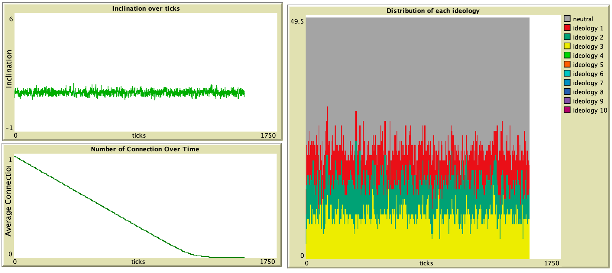

# **Opinion Dynamics and Echo Chambers in Social Media: An Agent-Based Simulation Approach**

This repository presents a simulation study on **opinion formation and polarization in online social networks**, using an **agent-based model** to explore how different algorithmic recommendation strategies affect the emergence of **echo chambers**.

> 📘 **Course Project**  
> This project is the final assignment for the course *Computational Social Science* (Spring 2024), jointly offered to students in the **Department of Political Science** and the **Department of Sociology**, **National Taiwan University**.

## 🧠 Overview

With the rise of social media, recommendation algorithms play a growing role in shaping our exposure to information—and by extension, our **ideologies and social interactions**. This project simulates how users' opinions evolve over time under various content-pushing strategies, such as:
- **Preference-based (self-reinforcing)** recommendation  
- **Network-based** recommendation  
- **Neutral/fair** (random) recommendation  

We model users as **agents** embedded in a social network, updating their ideological inclinations based on what they are exposed to, and disconnecting from others with opposing views when differences grow too large.

## 🧪 Model Description

- **Agents** hold probabilistic preferences over competing ideologies.
- Each round (tick), agents receive information based on a chosen **recommendation strategy**, and update their preferences accordingly.
- Agents disconnect from those with opposing views when ideological distance becomes too great.
- **Key variables**: learning rate (α, the extent to which an agent changes their ideological preference in response to incoming information), recommendation method, and network structure.

## 📊 Simulation Modes

Three recommendation strategies are compared:
1. **Preference-based ("Echo Chamber")**: Content is pushed based on current ideological preferences.
2. **Network-based**: Recommendations reflect the ideologies of social ties.
3. **Fair recommendation**: Equal probability of exposure to all ideologies.

We also test how different **network structures** (e.g. fully connected vs. modular networks) influence the speed and pattern of polarization.

## 📊 Simulation Results

### 🟥 Self-Reinforcing (Preference-Based)

  
*Agents gradually shift toward extreme positions. Network fragmentation occurs as ideological distances grow.*

---

### 🟦 Network-Based Recommendation

  
*Most agents maintain neutral positions. Network remains largely connected under low learning rate.*

  
*Higher learning rate leads to rapid polarization and formation of small extremist clusters.*

---

### 🟩 Fair Recommendation

  
*Balanced exposure keeps agents ideologically neutral and socially connected.*

  
*Even with fair recommendations, high learning rates cause rapid disconnection and fragmentation.*

## 💻 Environment

- **Language**: NetLogo
- **Version**: 6.4.0

## 📜 License

MIT License. See `LICENSE` for details.
